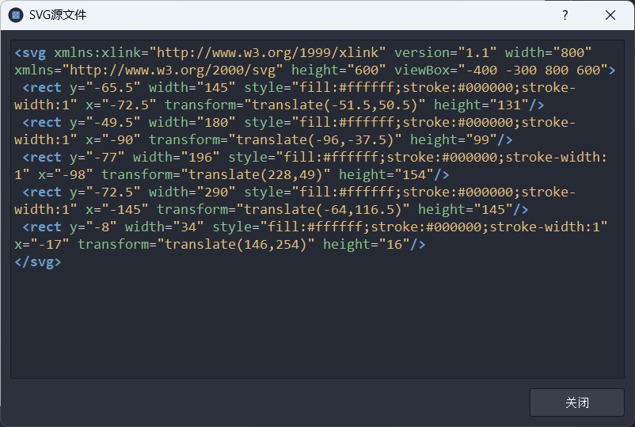

# SVG编辑器项目优势文档

## 1. 技术架构优势

- **解耦合架构**：完全分离的模块设计（UtilsLib、ShapeLib、CoreLib、UILib）
  - UtilsLib - 静态库
  - ShapeLib - 静态库
  - CoreLib -  动态库
  - UILib - 动态库

- **降低复杂度**：每个模块职责明确，减少代码重复

- **动态链接优化**：使用动态链接库共享代码，减小主程序体积

  

## 2. 用户体验优势

- **欢迎界面**：友好的启动体验，快速访问最近文件

  

  

- **标尺**：辅助精确定位和对齐

  

- **中英文切换 : ** 对不同人群，营造良好的使用体验

- **源代码高亮**：对svg源代码高亮显示

  

- **撤销/重做**：多级操作历史，支持复杂编辑撤销

- **快捷键体系**：全面的键盘快捷操作，提升专业用户效率

- **多标签设计**：同时编辑多个文档

  

