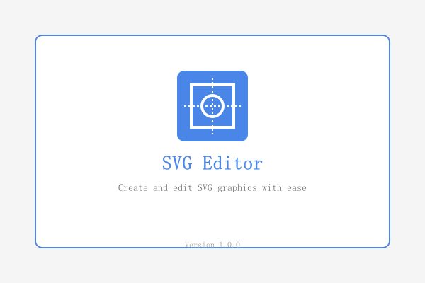
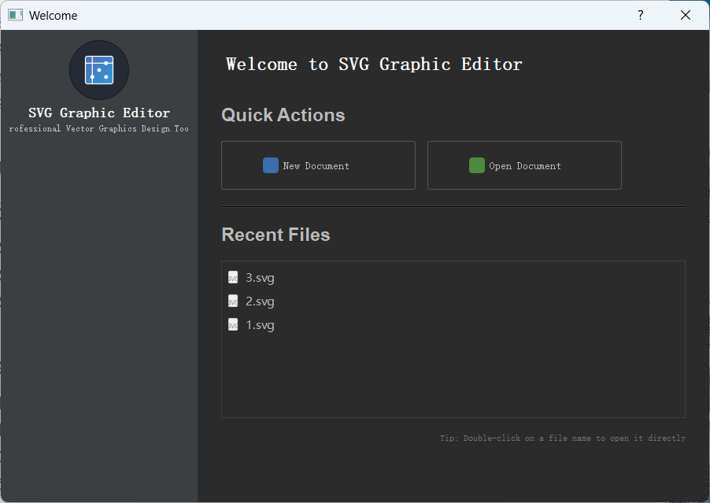
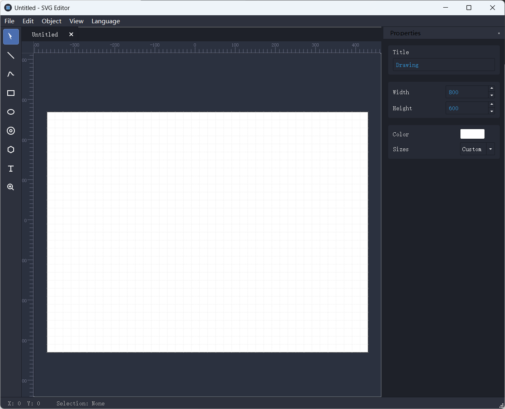
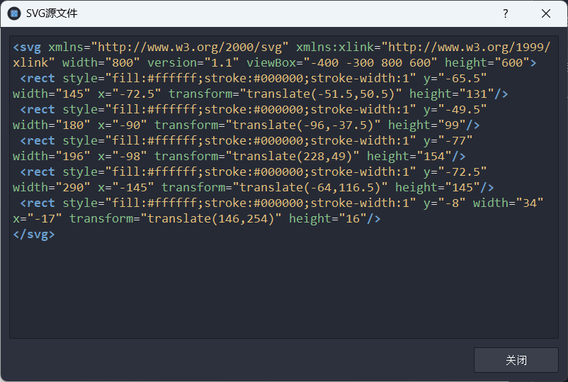
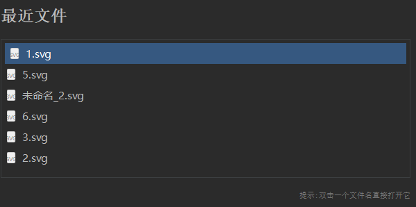

# SVG编辑器功能文档

## 1. 项目概述

SVG编辑器是一个基于Qt的矢量图形编辑工具，采用模块化设计，提供丰富的图形编辑功能。本文档详细介绍编辑器的功能和使用方法。

## 2. 系统架构

项目分为四个个主要模块：

- **UtilsLib**:	 基础工具库，包含配置、通用函数和语法高亮   
- **ShapeLib**:  图形对象库，包含所有基本图形类
- **CoreLib**:     核心库，负责文档和命令处理
- **UILib**:          用户界面库，包含所有UI组件和窗口

## 3. 用户界面

### 3.1 启动画面

### 3.2 欢迎界面

- **新建文档**: 创建一个新的SVG图形文档

- **打开文档**: 打开已有多个的SVG文件

- **最近文件**: 显示并快速打开最近编辑的文件列表

  

  

### 3.3 主编辑界面

- **菜单栏**
  - **文件操作 :**  新建文档，打开svg文档，储存当前文档，储存所有文档，导出png, 关闭当前文档，关闭所有文档，退出
  - **编辑操作 :**  重做，撤销，剪切，拷贝，粘贴， 复制，删除
  - **对象操作 :** 上移， 移到顶层， 下移， 移到底层， 全选
  - **视图操作 :** 展示标尺，预览svg文件
  - **语言操作 :** 中文， 英文

-  **工具栏**
  - **选择工具 :**  多选，调整大小，移动，旋转
  - **直线工具 :** 创建直线
  - **画笔工具 :** 创建绘画线
  - **矩形工具 :** 创建矩形
  - **椭圆工具 :** 创建椭圆
  - **路径工具 :** 创建路径
  - **多边形工具 : **创建多边形
  - **文本工具 :**  创建文本 
  - **放大镜工具 :** 放大 和 缩小

- **画布区**: 主要的图形编辑

- **属性面板**: 编辑所选图形的属性

- **标尺**: 提供精确测量功能

  

  

## 4. 主要功能

### 4.1 文件操作

- **新建文件**: 创建空白SVG文档
- **打开文件**: 打开现有SVG文件
- **保存/另存为**: 保存当前编辑的文档
- **全部导出 : ** 保存所有的文档
- **导出PNG**: 将SVG导出为PNG图像

### 4.2 绘图工具

- **选择工具**: 选择、移动、调整图形
- **线条工具**: 绘制直线
- **矩形工具**: 创建矩形和正方形
- **椭圆工具**: 绘制椭圆和圆形
- **多边形工具**: 创建多边形
- **路径工具**: 绘制贝塞尔曲线路径
- **钢笔工具**: 自由绘制线条
- **文本工具**: 添加和编辑文本
- **缩放工具**: 放大或缩小视图

### 4.3 编辑功能

- **复制/粘贴/剪切**: 基本编辑操作
- **删除**: 移除所选图形
- **撤销/重做**: 撤销或重复上一步操作
- **图层操作**: 调整图形的前后顺序
  - 置于顶层
  - 上移一层
  - 下移一层
  - 置于底层
- **全选操作**

### 4.4 属性编辑

- **填充颜色**: 设置图形填充颜色
- **描边颜色**: 设置图形轮廓颜色
- **描边宽度**: 调整线条粗细
- **描边样式**: 设置线条样式（实线、虚线等）
- **文本属性**: 字体、大小、对齐方式等

### 4.5 视图功能

- **显示/隐藏标尺**: 切换标尺显示

- **查看源代码**: 显示当前SVG的XML源码

  

### 4.6 多语言支持

- **中文界面**: 支持中文界面显示
- **英文界面**: 支持英文界面显示

## 5. 配置系统

- **窗口设置**: 记忆窗口大小和位置

- **语言设置**: 保存用户界面语言选择

- **最近文件记录**: 保存最近打开文件的历史

  

## 6. 键盘快捷键

| 功能          | 快捷键          |
| ------------- | --------------- |
| 新建文件      | Ctrl+N          |
| 打开文件      | Ctrl+O          |
| 保存          | Ctrl+S          |
| 另存为        | Ctrl+Shift+S    |
| 关闭          | Ctrl+W          |
| 撤销          | Ctrl+Z          |
| 重做          | Ctrl+Shift+Z    |
| 剪切          | Ctrl+X          |
| 复制          | Ctrl+C          |
| 粘贴          | Ctrl+V          |
| 复制          | Ctrl+D          |
| 全选          | Ctrl+A          |
| 删除          | Delete          |
| 置于顶层      | Ctrl+Shift+Up   |
| 上移一层      | Ctrl+Up         |
| 下移一层      | Ctrl+Down       |
| 置于底层      | Ctrl+Shift+Down |
| 显示/隐藏标尺 | Shift+R         |

## 7. 技术特点

- **模块化设计**: 各功能模块独立，便于维护和扩展
- **标准SVG支持**: 完全兼容SVG标准格式
- **动态组件加载**: 优化程序启动和运行性能
- **多平台支持**: 基于Qt跨平台框架，支持Windows、macOS和Linux
- **优化程序体积**: 通过动态链接库共享代码，减小可执行文件大小
